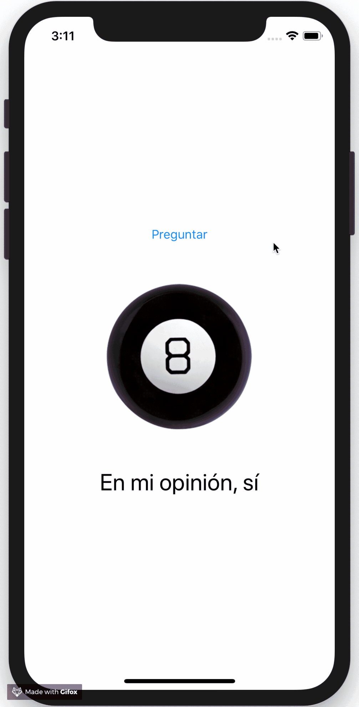
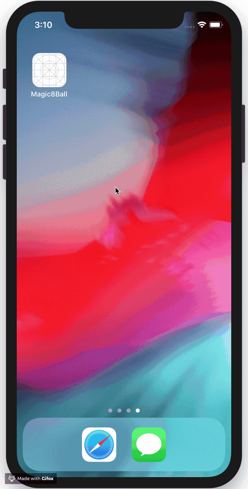

# Magic 8 Ball 

</img>

You can find images and text resources in `Resources` folder.

Do not forget install Xcode:
https://itunes.apple.com/cl/app/xcode/id497799835?mt=12

| Screenshot | Gif in action |
|---|---|
|  |  |
